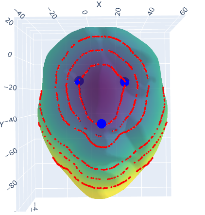

# **Geodesic Distance and Visualization on 3D Meshes**

This project is a Python-based tool to compute **geodesic distances** on 3D mesh surfaces, visualize contours based on these distances, and explore the geometry of meshes using data from `.obj` files. The repository is modular and extendable, allowing you to test and add new features efficiently.

---

## **Features**
- **Load and Parse 3D Meshes**: Efficiently read `.obj` files containing vertices and face data.
- **Geodesic Distance Calculation**: Compute the cumulative geodesic distances across the mesh from specified seed points.
- **Bipolar Contour Visualization**: Create and plot contours on the mesh, highlighting regions based on distance thresholds.
- **Lightweight Testing**: Built-in unit tests to validate core functions like mesh loading and geodesic computations.
- **Modular Design**: Extend functionality by adding new features with minimal disruption.

---

## **Project Structure**
```plaintext
project-root/
├── mesh_processing	/
│   ├── __init__.py          # Marks src as a package
│   ├── mesh_loader.py       # Functions for loading .obj meshes
│   ├── geodesic_distance.py # Geodesic distance computation
│   ├── visualization.py     # Plotting and contour visualization
│   ├── constants.py         # Constants like seed indices and file paths
│   └── utils.py             # Helper functions for reusability
├── tests/
│   ├── test_mesh_loader.py  # Unit tests for mesh loading
│   ├── test_geodesic.py     # Unit tests for geodesic computation
│   └── test_visualization.py# Unit tests for visualization
├── data/
│   ├── sample.obj           # Sample 3D mesh (ensure `.gitignore` excludes large files)
│   └── README.md            # Instructions for dataset setup
├── README.md                # Documentation for the project
├── .gitignore               # Ignore unnecessary files (e.g., large .obj files)
├── requirements.txt         # Required Python packages
└── main.py                  # Main script to run the project
---
## Results

Below is an example of the geodesic distance visualization with contour lines plotted at different level sets:



This image showcases how the sum of geodesic distances to three reference points is visualized on the 3D mesh, with contours highlighting specific distance thresholds. The points marked in blue are the seed points used for the geodesic calculations.
---
